# XGBoost Score Card

## 1 项目名称

基于XGBoost算法的评分卡，简称**XGBcard**。

## 2 项目简介

本项目基于梯度提升树，开发了一种自动构建评分卡的方法。并且项目提出了一种有监督的`提升树分箱`方法，将变量分箱过程和模型训练过程相结合，既可以实现自动构建评分卡模型的需求，又可以提升模型效果，且具备良好的评分解释性，此外，提升树分箱可直接应用到逻辑回归评分卡中，能够显著提升模型效果。

> 注：本项目开发过程中所使用的梯度提升树算法为XGBoost，理论上所有基于梯度提升树的算法均支持，包括但不限于gbdt、xgboost、lightgbm和catboost算法。

## 3 理论说明

根据XGBoost论文所述，我们训练的模型包括K颗树，模型预测分数为：

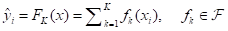             (1)

其中，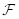为包含所有回归树的函数空间，回归树是一个将属性映射到分数的函数；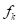为第k颗回归树的预测分数，即叶子节点的分数；K为回归数的个数；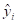为第i个样本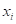的预测值。

对于二分类问题，我们需要把模型的预测分数映射到[0,1]之间，因此我们可以使用sigmoid函数，其二分类模型可以表达为：

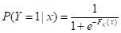                  (2)

即：

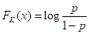                   (3)

XGBoost模型的参数为每棵树的结构和叶子节点的分数。其中，树的结构是我们需要调节的模型超参数，叶子节点的分数是回归树函数，即我们要学习的参数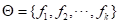。

为了能够提取XGBoost模型的提升树分箱，我们使用仅有两个叶子节点的树在前一步的残差上训练梯度提升树，损失函数为：

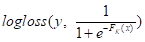                  (4)

其中，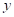为样本的实际标签，logloss为对数损失函数。

XGBoost模型的超参数选择采用基于高斯过程的贝叶斯优化，可以更快更好地寻找到最优超参数，然后，提取最优超参数训练梯度提升树模型。

经过提升算法的不断迭代，模型预测和特征分箱同时进行，既能提升模型的预测效果，同时获取每个特征的区间划分，即`提升树分箱`。

> 参考文献：XGBoost：A Scalable Tree Boosting System

## 4 XGBcard框架简介

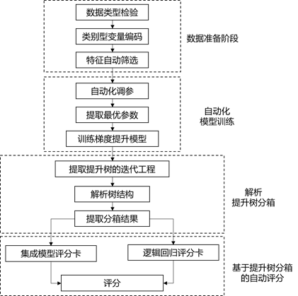

基于XGBoost的评分卡自动构建方法（XGBcard评分工具）依流程可以分成4个阶段：

- 基础数据准备阶段
- 自动化模型训练阶段
- 解析提升树分箱阶段
- 基于提升树分箱的自动评分阶段

四阶段的评分卡构建过程均可自动执行，无需人工参与，实现评分模型的自动生成；另外，评分工具的不同模块耦合性较小，均可单独使用或者人工调整。

**XGBcard的实现思路：**

（1）首先，针对输入数据进行类型检测，将数据全部转换为数值类型，并基于梯度提升树自动筛选变量。

（2）而后，采用贝叶斯优化自动调节梯度提升树模型的参数，提取最优参数训练提升树模型。

（3）接下来，解析提升树模型的树结构，获取提升树分箱结果。

（4）最后，基于提升树分箱完成自动评分，支持集成模型评分卡和逻辑回归评分卡两种评分模型。

## 5 XGBcard模块介绍

按照评分工具的执行过程，XGBcard的实现模块分为以下几个部分：

- `VarTypeClassify`：区分数值型变量和类别型变量；
- `CategoricalEncoder`：将类别型变量转化为数值型变量，目前支持`badrate`和`woe`编码；
- `VarsFilter`：特征自动筛选；
- `AutoTuningParams`：采用贝叶斯优化自动调参；
- `ScoreCard`：生成评分卡；
- `Metrics`：评估和监控模型效果；
- `Utils`：基本函数；

下面对以上模块作简要介绍，详细内容可查看代码及注释。

#### 5.1 `VarTypeClassify`模块

该模块用于数据类型检测。

由于大多数模型只能接受数值型输入，所以需要对类别型输入进行预处理，本模块就是用于区分两类变量。首先对输入数据的每个变量的数据类型进行检测，将特征划分为数值型变量和类别型变量。

#### 5.2 `CategoricalEncoder`模块

该模块用于将类别型变量转化为数值型变量，目前支持`badrate`（坏样本率）编码和`woe`编码。

- `坏样本率编码`是用每个变量在各个特征取值上的坏样本占比代替类别型变量。

- `WOE编码`是用“特征的每个分组中响应客户占样本中所有响应客户的比例“与”特征的每个分组中没有响应的客户占样本中所有没有响应客户的比例”的比值的对数代替类别型变量。两种类别型变量的编码方式都体现了特征在不同取值下的区分性。

#### 5.3 `VarsFilter`模块

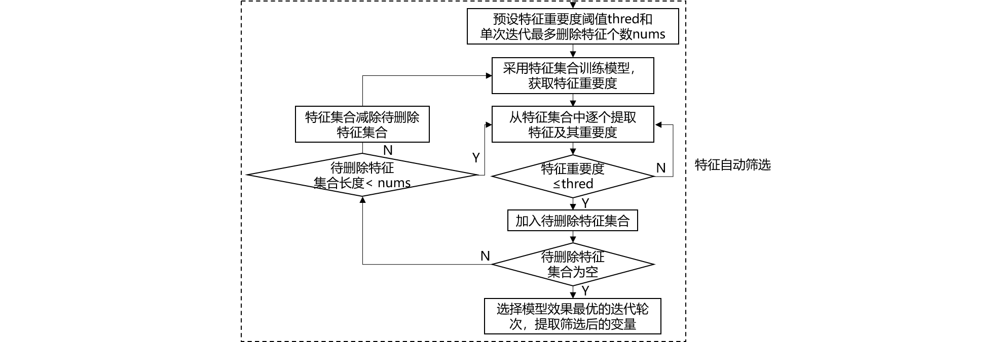

该模块用于特征自动筛选。

使用`XGBoost`算法进行特征筛选。这里使用一种基于迭代思想的特征筛选方法来完成特征的自动筛选，这样做的目的是削弱特征之间的相互影响。特征自动筛选的过程如图所示，本初步筛选方案的精华在于，使用特征重要度阈值`thred`参数控制每一次删除的特征重要性，使用单次迭代最多删除特征个数nums控制每一次循环删除特征的个数，这在一定程度上避免了特征之间的干扰。

#### 5.4 `AutoTuningParams`模块

该模块用于自动调参。

`XGBoost`模型的超参数选择采用基于高斯过程的贝叶斯优化，可以更快更好地寻找到最优超参数，然后，提取最优超参数训练梯度提升树模型。

自动调参使用`skopt`模块的`gp_minimize`函数。

#### 5.5 `ScoreCard`模块

该模块用于生成评分卡。

`scorecard`模块使用`AutoTuningParams`模块选择的最优超参数训练模型，然后进行评分映射（PDO = 40, 600 = 10:1 odds，分数越高，风险越小）。模块中包括模型训练函数`XGBcard.train`和模型评价函数`XGBcard.eval`，以及评分函数`XGBcard.scoring`和评分卡明细函数`XGBcard.score_card`，`XGBcard.scoring`用于直接输出样本评分，`XGBcard.score_card`用于输出评分卡明细（包括特征分箱及其分数明细）。

#### 5.6 `Metrics`模块

该模块用于评估和监控模型效果。

`Metrics`模块包括如下函数：

- `plot_roc_curve`：绘制训练集和测试集的ROC曲线；
- `plot_ks_curve`：绘制KS曲线；
- `plot_divergence`：绘制好坏样本的分布区分曲线；
- `report`：输出模型报告；
- `plot_chart`：输出模型表现（ks-badrate、bin_cnt-badrate等）；

#### 5.7 `Utils`模块

该模块包括评分工具中使用的一些基本函数。

## 6 XGBcard使用指南

